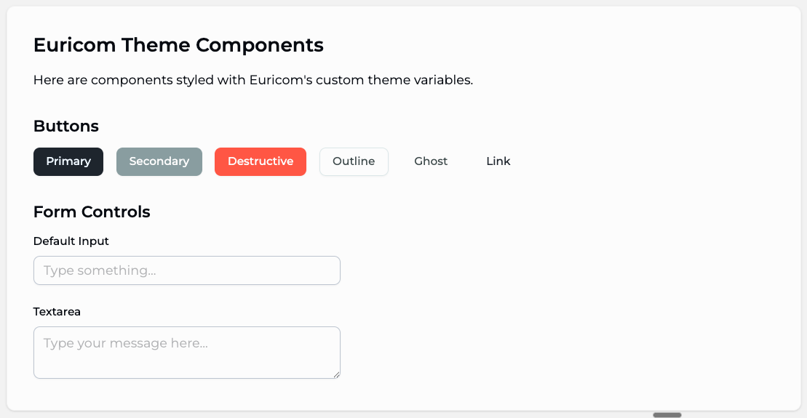

## Euricom Tailwind Theme Integration

This package provides a basic brand theme for internal Euricom projects that follows our new branding guidelines. It supports both **light** and **dark** themes out of the box.

## Requirements ⚠️
- tailwind CSS V4 
- shadcn/ui


## Quick Start

```sh
# install dependencies
pnpm install

# startup (dev mode)
pnpm dev
```

## Option: Default Theme

For projects using the default theme:

```bash
copy the "theme.euri.css"
```

## Option: ShadcN Theme

For projects using ShadcN components:

```bash
copy the "theme.euri.css"
```

```bash
copy the "tailwind.css"
```	

⚠️ **Important**: Copy the following modified ShadcN components to replace the default ones in your project:
```
button.tsx
input.tsx
textarea.tsx
tabs.tsx
```

## Color Configuration

Default: Tailwind colors disabled (`--color-*: initial`)

To enable Tailwind colors, remove this line from `theme.euri.css`:

```css
@theme {
   --color-*: initial; /* Remove this line to enable Tailwind colors */
}
```

## Show Cases

### Dark


### Light



